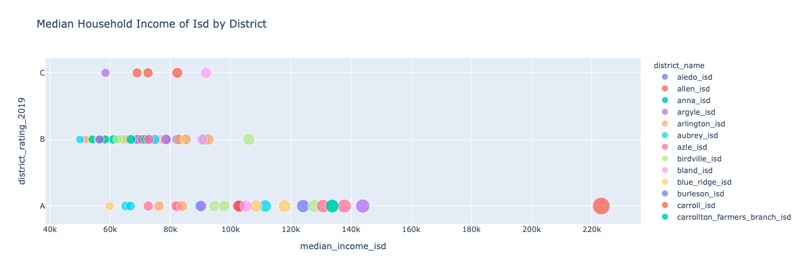
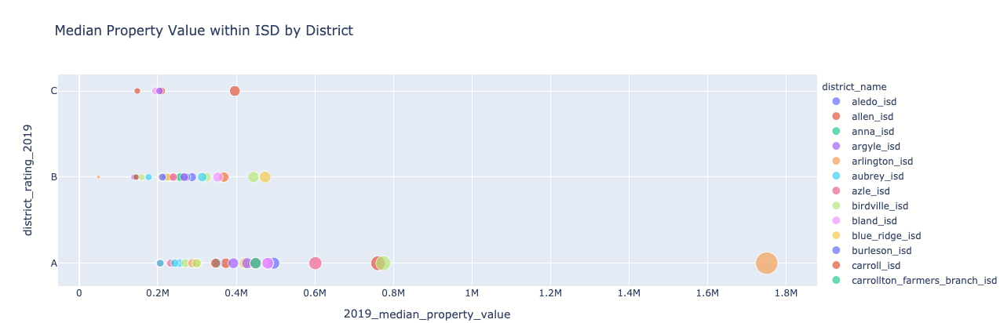
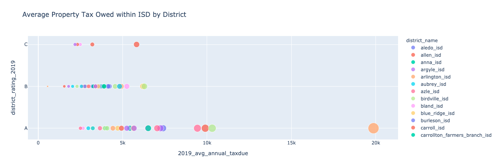
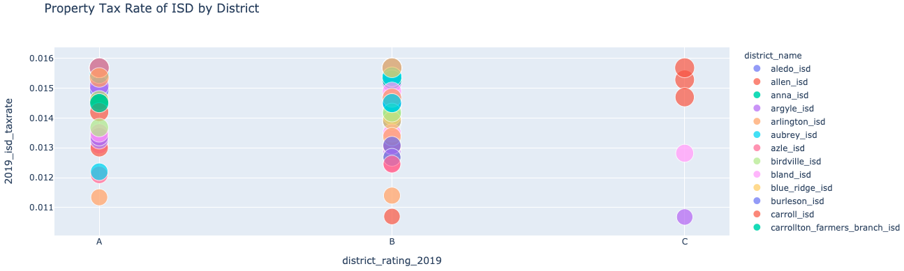
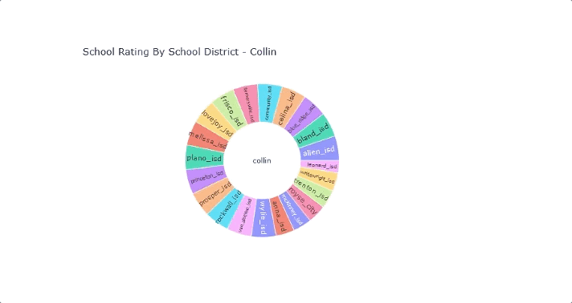
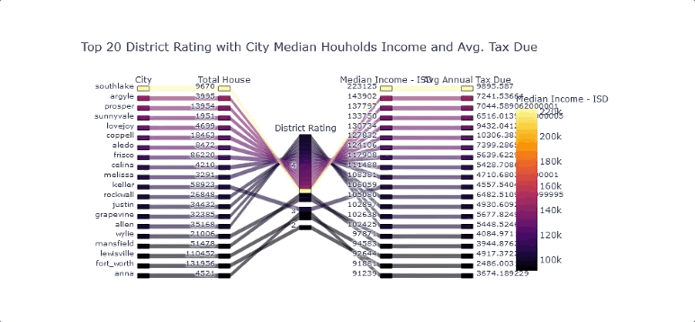
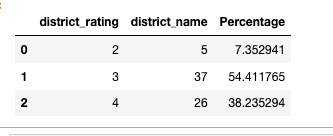
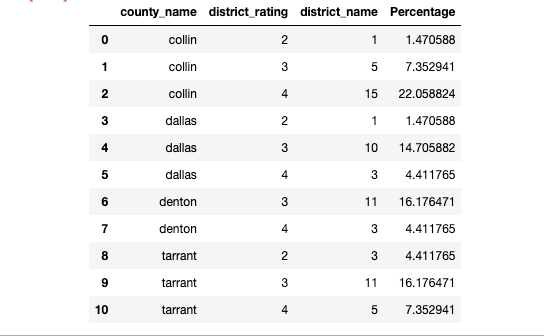

# Project-1

# 
 Housing and Schooling 

  
 Where to go for the perfect house for your family and the perfect school for your children. 

## Premise
We are working for a real estate company in the Dallas-Fort Worth Metroplex that wishes to specialise in sellings homes to families coming into the area. 

We have created  a Dashboard where parents/potential house buyers can easily click through the public school districts in the four main DFW Counties to see what is the best bang for their buck they can get school district wise. 

## Data

We cleaned up the data from multiple sources, the previously mentioned TEA and Appraisal Districts for the counties. We combined the data into a single .csv file.

**Data Included**
| Years  | Type of Data  |
| ------------- | ------------- |
| N/A |  County Name  |
| N/A | School District Name  |
| 2019 | Median Income |
|2016-20 |Total Property Values per ISD |
|2016-20 |Median Property Values per ISD | 
|2016-20 |Taxes Due per ISD |
|2016-20 |Annual Taxes Due |
|2018/19 | District Academic Ratings |

**Potential Data Issues** 

* School District Ratings: Only two years of Data due to a change in Ratings to A-F from a pass-fail in previous years and a lack of data due to the strange 2020 Covid school year. 
   

Finalized Data: [School District Rankings & Property Tax](dfw_real_estate_isd.csv)

## Process

* TEA spreadsheets provide comptroller tax information, including property tax rates by district for the specified tax years. These files that were downloaded from the site needed to be shortented. A district's property tax rate consists of a maintenance and operations (M&O) tax rate and, an interest and sinking (I&S) tax rate. The M&O tax rate provides funds for maintenance and operations. 
* The I&S tax rate provides funds for payments on the debt that finances a district's facilities. The calculation of state funding for school districts is tied to tax effort; thus, tax rates provide an essential component in the state's school finance formulas. With these detail informations, one master .csv file is created.
* The data had school Rating in Character. The character representation were transformed into numeric representation with 4 scale.
* The API from Texas Education Agency Public Open Data Site was used for getting the  current school information. The API  covers school educational information along with schools' locations, schools' contact information, such as phone numbers, fax numbers, emails,  and school scores.
* The data collected from both sources were cleaned. Some of the null value were fill with value accordingly

## Analysis

There are several categories you can divide most of these school districts into with our system we have devised. 

The most informative for our purpose of devising the code/program we did would be the “Best Value” and the “Worst Value”. While Highland Park scores extremely high on our scale, it is also one of the most expensive places Independent School Districts, it is the same with Southlake Carroll. People who just want the best possible school district without regards to the price would not need the creation that we devised. 

Best Values if looking for cheap house/good school: 

| ISD  | School Rating  | Median House Value | Tax Rate | Tax Owed |
| ------------- | ------------- |---| --- | --- | 
|Farmersville| A |206, 990 USD |.0121% |2503.38 USD |
|Bland | A | 202,653 USD | .0131 % |2654.75 USD |
|HEB | A |243,345 USD |.0112% | 2968.809 USD |
|Blue Ridge| A | 205,297 USD |.0114% |2340.39 USD |
|ERA | B |48,839 USD |.0114% |556.76 USD |

Worst Value for cheap house/good school
| ISD  | School Rating  | Median House Value | Tax Rate | Tax Owed |
| ------------- | ------------- |---| --- | --- | 
|Godley | C |396,340 USD |.0147% |5826.20 USD |
|Dallas | B |473,428 USD |.0131% |6203.74 USD |
|Desoto | C |188, 759 USD |.0149%| 2812.51 USD |
|Leonard| C |166,413 USD | .0115%| 1913.75 USD  |
|Lake Worth | C |129,349 USD |.0162% |2095.45 USD  |

* Overall while the best choice in schools are found in the areas with the highest median income

## Charts

## GIF of Dashboard

## Conclusion
### The Program
* The Code worked to our expectations, it painted a picture that we would be willing to show prospective real estate buyers who are looking to move in the DFW Metroplex. It's a basic overview of all of the school districts but could be easily modified for more details in both the school rankings and what specific schools are the best in the Districts fairly easily. 

### The Results 
* The Results from our program fell in line with what could be expected. The best performing schools were not correlated with the property tax percentage but the overall property values & median income. It did not matter if you had a high property tax percentage going to schools as long as the median property value was expensive. After all 5% of 500 dollars is worth more than 10% of 50 dollars. 
* As shown in the analysis we were able to show a wide variety of the best school districts, the value school districts, and the school districts to avoid at all cost. 
* Anyone who uses our tools should be able to figure out the best schools, see connections of school performance amongst all of our data points and make the  

## Project Worked On By: 
* [Jimmy Brown](https://github.com/jbrown2155) Primary Data Cleaner & Gatherer/Reviewed code.
* [Syeda Hasan](https://github.com/rimpi1612) Primary Coder
* [David Ready](https://github.com/CrusadingGroundhog) Primary work for Read.Me / Reviewed code.
